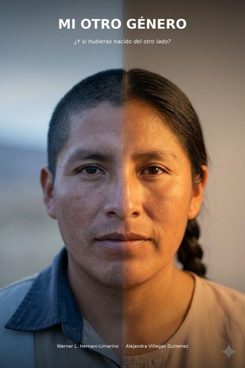
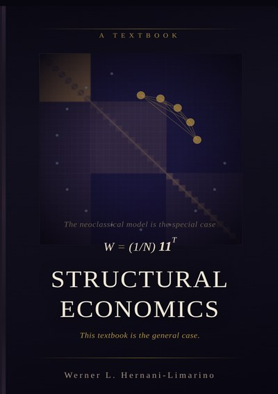
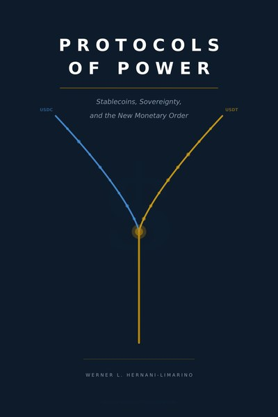
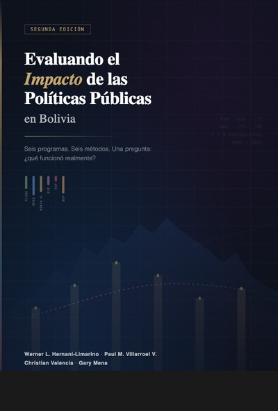
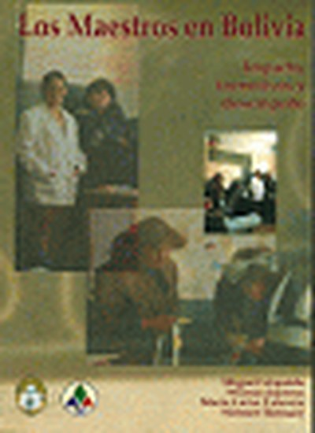

::: {.section-rule}
Books
:::

<!-- ── Mi Otro Género ── -->
::: {.book-card}
::: {.book-cover}

:::
::: {.book-info}
::: {.book-title}
Mi Otro Género
:::
::: {.book-subtitle}
Un ejercicio contrafactual sobre la vida que el género te negó
:::
::: {.book-meta}
With Alejandra Villegas Gutierrez · Primera edición · 2026
:::
::: {.book-summary}
Carla and Carlos were born on the same day, to the same parents, in the same neighborhood of La Paz. Thirty-two years later, Carlos is a civil engineer with a stable salary; Carla dropped out of university when she got pregnant and now works part-time selling clothes by catalog. What part of that divergence is due to the chromosome?

*Mi Otro Género* asks that question with economic rigor and answers it with three layers of evidence: population-level estimates from Bolivian national surveys, within-pair comparisons of opposite-sex fraternal twins, and structured interviews with those same twins. Each layer answers a different question — *how much*, *how much of it is gender*, and *how*. Bolivia is the laboratory: a country where legislative gender parity coexists with some of the most persistent gender norms in Latin America, where a woman can hold a seat in parliament and still be unable to decide whether to use contraception.

The book measures the cost of gender assignment in both directions — what women lose *and* what men forgo — treating both as rational agents navigating a system of constraints they did not choose.
:::
::: {.book-links}
[Download book](files/mi_otro_genero.pdf){.book-link}
[Slides (EN)](files/mi_otro_genero_slides_EN.pdf){.book-link}
[Slides (ES)](files/mi_otro_genero_slides_ES.pdf){.book-link}
:::
:::
:::

---

<!-- ── El Paisaje Roto ── -->
::: {.book-card}
::: {.book-cover}

:::
::: {.book-info}
::: {.book-title}
El Paisaje Roto
:::
::: {.book-subtitle}
Movilidad social en Bolivia
:::
::: {.book-meta}
Plural Editores · 2026
:::
::: {.book-summary}
Bolivia spent half a century building schools, extending roads, and passing reforms. And yet, where you are born still largely determines where you end up. *El Paisaje Roto* asks why — and maps the answer across all 339 municipalities, five census rounds (1976–2024), and four dimensions of stratification: geography, ethnicity, gender, and migration.

The book introduces the *mobility landscape* as its central metaphor and analytical tool: a terrain of slopes (*pendientes*) and gates (*portones*). Slopes measure how steep the climb from one generation to the next is; gates measure how firmly the top is sealed. Bolivia has two distinct traps — a poverty trap that keeps the bottom stuck, and a privilege trap that keeps the top closed — and they operate through different mechanisms and require different policies.

The final section asks an uncomfortable question: who benefits from immobility? Using evidence from Bolivia's 1990s natural experiment, the book identifies the actors, the four mechanisms through which advantage is reproduced, and what a targeted connectivity policy — built on the LADDER/GATE classification of municipalities — would cost and deliver.
:::
::: {.book-links}
[Download book](files/el_paisaje_roto.pdf){.book-link}
[Slides (EN)](files/slides_between_within_EN.pdf){.book-link}
[Slides (ES)](files/slides_entre_dentro_ES.pdf){.book-link}
:::
:::
:::

---

<!-- ── Structural Economics ── -->
::: {.book-card}
::: {.book-cover}

:::
::: {.book-info}
::: {.book-title}
Structural Economics
:::
::: {.book-subtitle}
The General Case
:::
::: {.book-meta}
Draft manuscript · 2027
:::
::: {.book-summary}
The neoclassical model rests on a single assumption: all agents receive equal weight in the social aggregation, encoded as W = (1/N)**11**ʹ. *Structural Economics* replaces that assumption with an arbitrary weight matrix W — and shows that the entire neoclassical edifice, from the welfare theorems to growth theory, is simply the special case where W happens to be uniform. This textbook is the general case.

The weight matrix is derived from three underlying networks that coexist in every economy: a production and exchange network that determines who transacts with whom, a power and bargaining network that determines whose preferences prevail in conflict, and an information network that determines whose beliefs are treated as authoritative. Together, these networks produce the Perron eigenvector that governs distributional outcomes — a quantity that standard theory assumes away rather than explains.

Organized in seven parts, the book covers the matrix reformulation of standard micro and macro, the formal model of endogenous preference formation (the Ψ ratio), the dynamics of structural change, measurement via social accounting matrices, and the political economy of hegemony and counter-hegemony. The final chapter, *The General Case*, derives the conditions under which the neoclassical model holds — and documents why they are almost never met.
:::
::: {.book-links}
[Download draft](files/structural_economics.pdf){.book-link}
:::
:::
:::

---

<!-- ── Hunger & Fire ── -->
::: {.book-card}
::: {.book-cover}

:::
::: {.book-info}
::: {.book-title}
Hunger & Fire
:::
::: {.book-subtitle}
How the Foods of the Oppressed Became the Meals of the Powerful
:::
::: {.book-meta}
2025
:::
::: {.book-summary}
Every economist knows Adam Smith's invisible hand. This book is about the other half — the invisible fist. The most extraordinary foods on earth were created by the most oppressed people on earth. Not as a coincidence. As a consequence. Constraint produces ingenuity; scarcity produces creativity. The people who received the scraps — the bones, the offal, the cheapest grains, the discarded parts — transformed those scraps into cuisines of astonishing depth and beauty. And then, with the predictability of a law of physics, the powerful took those cuisines.

*Hunger & Fire* follows ten dishes across ten chapters, each rooted in a specific place, a specific history, and a specific community whose culinary genius the world has consumed without adequate payment or credit: soul food and oxtail in the American South, ramen and the ruins of empire in Japan, feijoada in Brazil, hummus and the war of the chickpea in the Levant, jollof rice across West Africa, curry and the colonial flattening of a continent, phở in Vietnam, tacos and the death of sacred corn in Mexico, injera and teff in Ethiopia, and chuño — the freeze-dried potato that fed the silver mines of Potosí — in Bolivia.

Each chapter braids three strands: the political economy of how power shaped the food, the history of the specific events that produced the current situation, and the personal — eating and cooking these dishes, often with his daughter Anahí, the most honest food critic he has ever encountered.
:::
::: {.book-links}
[Read sample (Intro + Ch. 1)](files/hunger_fire_sample.pdf){.book-link}
[Kindle](#){.book-link .book-link-buy}
[Paperback](#){.book-link .book-link-buy}
[Audible — coming soon]{.book-link .book-link-soon}
:::
:::
:::

---

<!-- ── Protocols of Power ── -->
::: {.book-card}
::: {.book-cover}

:::
::: {.book-info}
::: {.book-title}
Protocols of Power
:::
::: {.book-subtitle}
Stablecoins, Sovereignty, and the New Monetary Order
:::
::: {.book-meta}
2025
:::
::: {.book-summary}
In Beirut, a mother uses a Telegram group and a Tron wallet to pay her son's university tuition in Paris. No bank, no SWIFT code, no government waiver. Two smartphones, a shared faith in a stablecoin, and a blockchain network that no finance ministry controls.

*Protocols of Power* is a diagnosis of the silent coup d'état reshaping global finance — not staged in parliaments, but in GitHub repositories, validator sets, and zero-knowledge proofs. Stablecoins are dollarizing the world faster than the IMF ever could. Tether running on Tron has become an informal SWIFT, FX market, and escrow system for billions of people locked out of the first world's banking networks. Exchanges have become stateless central banks. Protocols are absorbing the functions once performed by empires and states.

The book moves through ten chapters across four parts: the collapse of the Bretton Woods order and its shadow infrastructure replacement; the new empires (the digital yuan as surveillance state, Binance as a rival government, USDC as institutional finance on-chain); the new monetary weapons (financial weaponization of code, cold storage as sovereignty); and the endgame — a forked dollar and the outlines of a Shadow Bretton Woods II. Each chapter opens with a Frontline Dispatch: a fictionalized but documented scene from Beirut, Lagos, San Francisco, Guangzhou, Istanbul, Lima, Havana, Accra, and elsewhere. The characters are invented; the systems they navigate are real.
:::
::: {.book-links}
[Read sample (Preface + Ch. 1)](files/protocols_of_power_sample.pdf){.book-link}
[Kindle](#){.book-link .book-link-buy}
[Paperback](#){.book-link .book-link-buy}
:::
:::
:::

---

<!-- ── Evaluando ── -->
::: {.book-card}
::: {.book-cover}

:::
::: {.book-info}
::: {.book-title}
Evaluando el Impacto de las Políticas Públicas en Bolivia
:::
::: {.book-subtitle}
Segunda Edición
:::
::: {.book-meta}
With P.M. Villarroel, C. Valencia, and G. Mena · Fundación ARU / IISEC–UCB · 2015
:::
::: {.book-summary}
Between 2001 and 2015, Bolivia dramatically expanded social spending — emergency employment, universal pensions, school subsidies, literacy campaigns, youth training, and microcredit. The official verdict on every program was positive. This book tells a different story.

Six programs, six methods, one question: *what actually worked?* Using PSM, Differences-in-Differences, fuzzy Regression Discontinuity, Changes-in-Changes, structural household models, and Interrupted Time Series, the authors find results that are more complex and uncomfortable than official narratives admit. PLANE stabilized consumption during the crisis but built no employability. MPED produced a large jump in formal employment — which vanished within 18 months. Renta Dignidad increased household income but significantly reduced female labor supply. Bono Juancito Pinto only moved enrollment for children aged 6–8. Yo Sí Puedo certified 824,000 adults "literate" while direct tests showed virtually no gains in comprehension. BDP microcredit produced strong effects in manufacturing and zero in agriculture.

The cross-cutting lesson: heterogeneity is the rule, unintended effects are common, and positive impacts tend to be transitory. The book's final argument is institutional — Bolivia already produces good research; the binding constraint is the political will to let evidence matter.
:::
::: {.book-links}
[GitHub](https://github.com/wernerhl/evaluando-impacto-bolivia){.book-link target="_blank"}
:::
:::
:::

---

<!-- ── Los maestros ── -->
::: {.book-card}
::: {.book-cover}

:::
::: {.book-info}
::: {.book-title}
Los maestros en Bolivia: Impacto, incentivos y desempeño
:::
::: {.book-meta}
With M. Urquiola, W. Jiménez, and M.L. Talavera · Editorial Sierpe · 2000
:::
::: {.book-summary}
Bolivia had increased teacher salaries, expanded teacher training, and invested heavily in educational reform — yet student achievement remained stubbornly low. This book asks why, and what policy levers actually work.

Drawing on SIMECAL test scores, household surveys, teacher surveys, and qualitative fieldwork, the authors find that observable teacher credentials and salary levels have little impact on student achievement once student socioeconomic context is controlled for. Motivation and performance actually *decline* with seniority — the very variable that drives compensation under Bolivia's escalafón system. By contrast, teachers in private and Fe y Alegría schools — institutions with stronger performance incentives and clearer accountability — show systematically higher dedication and results.

The book reframes the policy question: not "are teachers well paid?" but "how should pay and incentives be designed to attract and motivate better teachers?" It evaluates Bolivia's proposed incentive systems — including the rural permanence bonus and the collective incentive scheme — and provides concrete design recommendations grounded in evidence.
:::
::: {.book-links}
[Read online](http://biblioteca.usfa.edu.bo/cgi-bin/koha/opac-detail.pl?biblionumber=5816){.book-link target="_blank"}
[Download PDF](https://www.aru.org.bo/REPEC/pdf/MaestrosBolivia.pdf){.book-link target="_blank"}
:::
:::
:::
