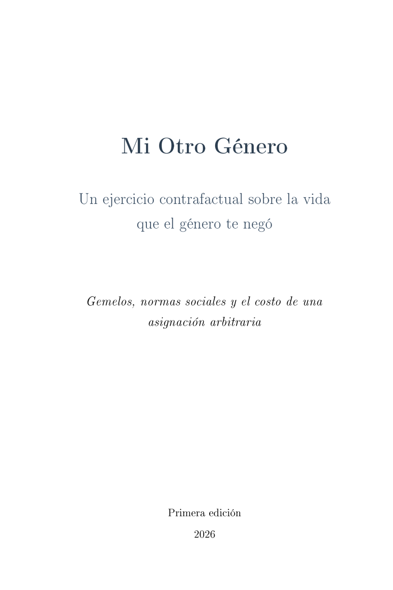

::: {.section-rule}
Books
:::

<!-- ── Mi Otro Género ── -->
::: {.book-card}
::: {.book-cover}

:::
::: {.book-info}
::: {.book-title}
Mi Otro Género
:::
::: {.book-subtitle}
Un ejercicio contrafactual sobre la vida que el género te negó
:::
::: {.book-meta}
Primera edición · 2026
:::
::: {.book-summary}
Carla and Carlos were born on the same day, to the same parents, in the same neighborhood of La Paz. Thirty-two years later, Carlos is a civil engineer with a stable salary; Carla dropped out of university when she got pregnant and now works part-time selling clothes by catalog. What part of that divergence is due to the chromosome?

*Mi Otro Género* asks that question with economic rigor and answers it with three layers of evidence: population-level estimates from Bolivian national surveys, within-pair comparisons of opposite-sex fraternal twins, and structured interviews with those same twins. Each layer answers a different question — *how much*, *how much of it is gender*, and *how*. Bolivia is the laboratory: a country where legislative gender parity coexists with some of the most persistent gender norms in Latin America, where a woman can hold a seat in parliament and still be unable to decide whether to use contraception.

The book measures the cost of gender assignment in both directions — what women lose *and* what men forgo — treating both as rational agents navigating a system of constraints they did not choose.
:::
:::
:::

---

<!-- ── El Paisaje Roto ── -->
::: {.book-card}
::: {.book-cover .book-cover-placeholder}
:::
::: {.book-info}
::: {.book-title}
El Paisaje Roto: Movilidad Social en Bolivia
:::
::: {.book-meta}
Plural Editores · 2026
:::
:::
:::

---

<!-- ── Hunger & Fire ── -->
::: {.book-card}
::: {.book-cover .book-cover-placeholder}
:::
::: {.book-info}
::: {.book-title}
Hunger & Fire: How the Foods of the Oppressed Became the Meals of the Powerful
:::
::: {.book-meta}
2025
:::
:::
:::

---

<!-- ── Evaluando ── -->
::: {.book-card}
::: {.book-cover .book-cover-placeholder}
:::
::: {.book-info}
::: {.book-title}
Evaluando las Evaluaciones de Impacto: Assessing the Impact of Social Policies in Bolivia
:::
::: {.book-meta}
Fundación ARU · 2015
:::
:::
:::

---

<!-- ── Los maestros ── -->
::: {.book-card}
::: {.book-cover .book-cover-placeholder}
:::
::: {.book-info}
::: {.book-title}
Los maestros en Bolivia: Impacto, incentivos y desempeño
:::
::: {.book-meta}
With M. Urquiola, W. Jiménez, and M.L. Talavera · Sierpe · 2000
:::
:::
:::
